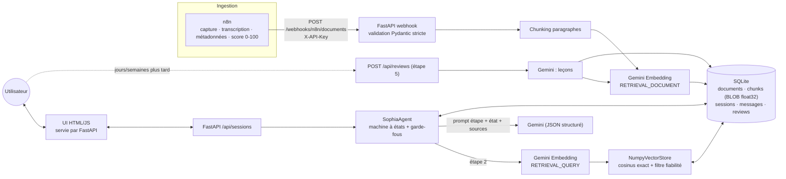

# Sophia — Architecture & choix RAG

## Schéma

La boucle d'apprentissage : la leçon produite à l'étape 5 est stockée comme un `Document`
(`source_type=feedback`, fiabilité 85 par défaut) → elle est retrouvée par le RAG de l'étape 2 des décisions suivantes.

## Choix de la recherche vectorielle : NumPy en mémoire + SQLite comme source de vérité

| Option | Avantages | Inconvénients | Verdict |
|---|---|---|---|
| **NumPy cosinus exact** | 0 dépendance native, exact, ~1 ms pour 50 k chunks × 768 d, filtrage par fiabilité trivial | Tout en RAM (768 d × 4 o ≈ 3 Mo / 1 000 chunks) | **Retenu** (PoC → ~100 k chunks) |
| sqlite-vec | Reste dans SQLite, KNN SQL | Extension native à charger (portabilité, Docker, Windows), encore pré-1.0 | Étape suivante si > 100 k chunks |
| FAISS en parallèle | ANN très scalable | Double stockage à garder cohérent, persistance d'index à gérer | Overkill à cette échelle |

Mise en œuvre (`app/vector_store.py`) :
- Embeddings normalisés L2 à l'écriture → le cosinus devient un simple produit scalaire (`matrice @ q`).
- SQLite est la **source de vérité** ; la matrice est un cache. Un tampon `(count, max id, somme des scores)` est relu
  (1 requête agrégée) à chaque recherche → rechargement automatique après une ingestion, même venant d'un autre process/worker.
- **Fiabilité** : (1) filtre dur `reliability >= RAG_MIN_RELIABILITY` (40) à l'étape 2 ; (2) pondération du classement
  `score = cosinus × (0.5 + 0.5 × fiabilité/100)`. Les sources < 50 restent éventuellement visibles mais le prompt impose
  de les signaler comme non vérifiées.
- L'interface `search(db, query_vec, top_k, min_reliability)` est la seule surface : migrer vers sqlite-vec/FAISS ne touche
  ni l'agent ni l'ingestion.
- Changer de modèle/dimension d'embedding : les chunks sont étiquetés `embedding_model` ; ceux d'un autre modèle sont ignorés
  (ré-ingérer les documents).

## Machine à états (5 étapes)

| Étape | Champs d'état autorisés | Garde-fou verrouillé dans le code pour avancer |
|---|---|---|
| 1 Définir | problem_statement, root_cause, root_cause_confirmed | Cause racine **confirmée explicitement**, et seulement un tour après sa proposition ; modifier la cause annule la confirmation |
| 2 Explorer (RAG) | solutions, scenarios | ≥ 1 solution retenue ; pour chacune : meilleur cas, pire cas, plan si échec |
| 3 Évaluer | evaluations, chosen_solution | Pros/cons pour chaque retenue + option choisie parmi elles |
| 4 Le faire | action_plan, decision_validated | Plan non vide + validation explicite (invalidée si le plan change) |
| 5 Apprendre | decision_summary | Session `awaiting_review` → `POST /api/reviews` (asynchrone, 1 par décision) |

Le LLM renvoie un JSON structuré `AgentTurn` (réponse + mises à jour d'état). Le code filtre les champs par étape et
décide seul du passage à l'étape suivante (`POST /advance` → 422 avec la liste de ce qui manque).

## Sécurité (PoC)
- Webhook protégé par `X-API-Key` (comparaison à temps constant, fermé si la clé n'est pas configurée), payload `extra=forbid`, tailles bornées.
- Injection de prompt : sources et messages utilisateur encadrés et déclarés comme *données* dans le prompt système ; le code, pas le LLM, contrôle les transitions.
- Frontend : `textContent` uniquement, CSP `default-src 'self'`, pas de script inline.
- Secrets en variables d'environnement (`.env` ignoré par git).
- **Limites connues du PoC** : pas d'authentification utilisateur (l'id de session, un UUID aléatoire, sert de jeton) ni de rate limiting ; à ajouter avant une mise en production.
